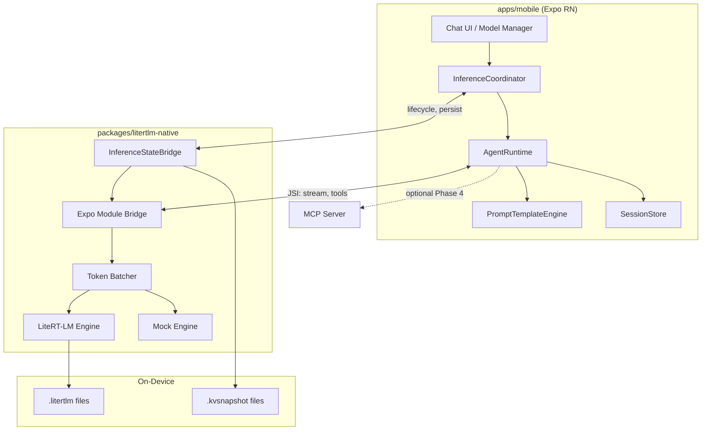

# liteRTLM Architecture

Expo(React Native) + LiteRT-LM 기반 **온디바이스 Agent Chat** 앱의 컴포넌트 간 계약과 인터페이스 형태.

참조 자료: [.references/](./.references/)

---

## 1. 계약사항 (불변 규칙)

아래 규칙은 구현·리팩터링 시 **반드시** 지킨다. 형태(§2)는 이 규칙을 만족하도록 구현한다.

### 1.1 프라이버시·추론 위치

- **모든 LLM 추론은 사용자 기기에서만** 수행한다. 프롬프트·응답·대화 기록을 추론 목적으로 외부 서버에 전송하지 않는다.
- 네트워크는 **모델 다운로드**, **(선택) MCP/외부 API 도구 실행**, **앱 업데이트**에만 사용한다. MCP 사용 시에도 **추론·tool 선택은 온디바이스**를 유지한다.

### 1.2 추론 엔진

- 온디바이스 LLM 런타임은 **LiteRT-LM 단일 스택**만 사용한다 (Gemma 4 E2B/E4B `.litertlm`).
- JS 번들에서 직접 모델 가중치를 로드하거나, llama.cpp 등 **대체 런타임을 혼용하지 않는다**.

### 1.3 플랫폼·빌드

- 모바일 타깃: **iOS 17+**, **Android 12+**.
- **Expo Go는 지원하지 않는다.** `expo-dev-client` development build만 사용한다.
- LiteRT-LM은 **네이티브 모듈**(`packages/litertlm-native`)로만 접근한다. JS에서 JNI/Swift를 우회 호출하지 않는다.

### 1.4 모델

- 1차 지원 모델: **Gemma 4 E2B IT**, **Gemma 4 E4B IT** (`litert-community` Hugging Face).
- 모델 파일은 앱 번들에 포함하지 않고 **온디맨드 다운로드**한다 (용량·라이선스·기기별 선택).

### 1.5 에이전트

- **Agent Chat**은 LiteRT-LM **Conversation + (optional) Tools** 위에서 동작한다.
- Tool 실행 결과는 대화 컨텍스트에 반영한 뒤 최종 응답을 생성한다 (automatic 또는 explicit tool loop).

### 1.6 계층 분리

| 계층 | 책임 | 금지 |
|------|------|------|
| `apps/mobile` (RN) | UI, 네비게이션, 세션 UX, **InferenceCoordinator**, JS tool registry, MCP client, **PromptTemplateEngine**, tool 승인 UI, Snapshot/skeleton UX | LiteRT-LM 직접 import |
| `packages/litertlm-native` | Engine/Conversation, **InferenceStateBridge**, **배치 스트리밍**, native ToolSet, **Mock backend**, OS memory hooks | UI, 라우팅, chat template 하드코딩 |
| LiteRT-LM (외부) | 추론, KV-cache, constrained decoding, **모델 내장 Jinja template** | — |

### 1.7 스트리밍·브릿지 (Bridge Bottleneck)

- 네이티브는 디코드 토큰을 **토큰 단위로 JS에 즉시 emit하지 않는다**.
- `packages/litertlm-native`에서 **Token Batching** 필수: **~50ms 간격** 또는 **누적 N토큰(기본 8)** 중 먼저 도달 시 한 번에 flush.
- turn 종료·thinking/token 경계·flush 주기 만료 시 **잔여 버퍼는 즉시 flush**.
- JS `onStreamDelta` 수신 빈도 목표: **≤ 20 events/s** (60 tok/s decode 기준).

### 1.8 모델 무결성 (Corrupted Weights)

- 매니페스트 항목마다 **SHA-256 checksum 필수**. `sizeBytes`만으로는 install `ready` 불가.
- 다운로드 완료 → **checksum 검증 성공** → `status: 'verified'` → 그때만 `Engine.initialize(modelPath)` 호출.
- 검증 실패: 파일 삭제, `status: 'failed'`, Engine에 경로 노출 금지 (손상 가중치로 인한 **native crash** 방지).

### 1.9 프롬프트·템플릿 (Template Drift)

- 네이티브 브릿지에 `<start_of_turn>` 등 **모델별 chat template 문자열을 하드코딩하지 않는다**.
- Turn 포맷은 **LiteRT-LM Conversation API**(`Message.user` / `Message.model`, 모델 번들 Jinja template)에 위임.
- JS **PromptTemplateEngine** (`AgentRuntime` 내부): system instruction 합성, skill 블록 주입, `extraContext`(thinking 등), UI `Message[]` → native에 넘길 **의미론적 턴** 변환.
- Native는 **pre-rendered template string**이 아닌 구조화된 메시지·plain user text만 받는다.

### 1.10 도구 안전 (Tool Safety)

- **side-effect가 있는 도구**는 실행 전 **Human-in-the-loop 승인** 필수 (기본: write/destructive; read-only는 정책으로 opt-out 가능).
- Native `automaticToolCalling`이 켜져 있어도, `requiresApproval: true` 도구는 native가 **즉시 실행하지 않고** JS에 `onToolApprovalRequired` emit → 사용자 승인 후에만 실행.
- 승인 없이 만료·거부 시: tool result 대신 거부 사유를 모델 컨텍스트에 반환.

### 1.11 개발·Mock (Mock Gap)

- `litertlm-native`는 **`live` | `mock`** backend 모드 제공. Mock은 **모델 파일·Engine.initialize 없이** 동작.
- Mock은 설정 가능한 **tokens/sec**·canned response로 `onStreamDelta`를 배치 emit (§1.7 동일).
- UI·AgentRuntime 개발 시 **`EXPO_PUBLIC_LITERTLM_MODE=mock`** (또는 dev menu)로 전환. Mock/Live **동일 JS API surface**.

### 1.12 메모리·하이버네이션 (The Silent Killer)

LLM은 수백 MB~수 GB RAM을 점유한다. iOS/Android는 백그라운드·메모리 압박 시 **예고 없이 프로세스를 종료**한다. `initialize`/`shutdown`만으로는 부족하며, **누가·언제·얼마까지** 엔진을 유지할지 자동 정책이 필요하다.

#### 1.12.1 3-Tier Inference Lifecycle

엔진·대화 상태는 아래 **3단계** (+ 전이 상태)로 관리한다. `InferenceStateBridge`(§2.10)가 **유일한** lifecycle 진입점.

| Tier | RAM | GPU/NPU | 추론 | 전형적 전이 |
|------|-----|---------|------|-------------|
| **Active** | 모델 로드 | 가속기 hold | 즉시 가능 | foreground, 채팅 중 |
| **Idle** | 모델 유지 | **해제** | 재활성 시 GPU re-init | background 직후, 짧은 이탈 |
| **Hibernated** | **모델 unload** | — | restore 후 가능 | OS memory pressure, 장시간 background |

전이 상태(노출): `loading` | `restoring` | `hibernating` | `error` | `unloaded`

- **Active → Idle**: 앱 background 진입, generation 없음, **OS pressure 없음** → GPU만 해제 (모델 RAM 유지).
- **Idle → Hibernated**: (a) OS critical memory signal, (b) background **T_idle** 초과(기본 5분, 설정 가능), (c) 사용자 "메모리 확보".
- **Hibernated → Active**: `warmUp` + `restoreSession` (KV 스냅샷 있으면) + GPU re-init.
- **추론 중 background**: generation **즉시 abort** → Active 유지 또는 Idle (hibernate는 generation 종료 후).

#### 1.12.2 KV-Cache Persistence

- UI용 `SessionStore` 메시지 JSON과 **별도**로, native **`persistSession` / `restoreSession`** 으로 Conversation KV 상태를 디스크에 저장한다.
- 목적: 재진입 시 **과거 턴 prefill 재연산 제거** → TTFT 단축 (모델 cold load 시간은 별도).
- 스냅샷 경로: `{CacheDirectory}/inference/{conversationId}.kvsnapshot` (포맷은 LiteRT-LM serialize API 따름).
- **LiteRT-LM Kotlin/Swift persist API 미노출 시**(Phase 0 검증): fallback — `restoreSession` 생략, `SessionStore` 메시지로 **prefill replay** (느리지만 정확). 계약 API surface는 유지.

#### 1.12.3 Smart Eviction (OS 협상)

- **무조건 shutdown 금지.** OS가 critical 신호를 보낼 때만 Idle/Active → Hibernated.
- Android: `onTrimMemory(TRIM_MEMORY_RUNNING_CRITICAL)` (및 `UI_HIDDEN` 이후 정책적 Idle).
- iOS: `UIApplication.didReceiveMemoryWarningNotification`.
- 그 외 foreground·Idle 구간에서는 **메모리 점유 유지가 UX상 정답** (재로드 비용 > 점유 비용).

#### 1.12.4 Predictive Warm-up

- **Phase 1**: `AppState` → `active` 전환 **첫 콜백**에서 `warmUp(lastModelId)` (UI render 전 background).
- **Phase 2+**: 마지막 사용 모델·backend 기억, verified model path만 대상.
- **Phase 4 (optional)**: Push Notification Service Extension / App Intent에서 pre-warm (앱 프로세스 정책·OS 제한 준수).

#### 1.12.5 Perceived Latency (UX)

기술적으로 줄일 수 없는 구간은 **apps/mobile** UX로 흡수 (native 책임 아님):

- **Snapshot UI**: 마지막 채팅 화면 static snapshot → cold start instant feel.
- **Loading skeleton**: `loading`/`restoring` 중 progressive copy ("문맥을 복원하는 중…").

### 1.14 Agent Skills (Phase 3+)

- **Skills는 사용자 기기에 로컬 저장**한다. `SKILL.md` import·enable/disable은 사용자(또는 dev)가 명시적으로 수행한다.
- System prompt에는 **skill catalog**(name + description)만 노출한다. 전체 instructions body는 **skill invoke 시** PromptTemplateEngine이 merge한다 (§1.9).
- Skill 포맷은 Gallery / [Agent Skills spec](https://agentskills.io/specification) `SKILL.md` frontmatter를 따른다. `name`·`description`은 spec 검증 필수.
- **Text-only skill**은 추가 런타임 없이 prompt merge만으로 동작한다.
- **JavaScript skill**은 hidden WebView sandbox에서 실행한다. `window.ai_edge_gallery_get_result` 계약을 따른다. WebView는 AgentRuntime/추론 스레드와 분리한다.
- Skill import URL fetch는 **HTTPS only**. import·JS skill의 네트워크는 §1.1 추론 오프라인 규칙과 별도(사용자-initiated)이며, **추론 중 외부 API 호출을 skill이 암묵적으로 허용하지 않는다** — `compatibility`·승인 정책으로 opt-in.
- Native intent skill(share, open URL 등)은 §1.10 approval 정책을 따른다.

### 1.13 테스트·TDD (Test-First)

로직 변경·신규 기능은 **테스트 선행(TDD)** 을 기본으로 한다. 수동 E2E·스모크 스크립트만으로 완료를 인정하지 않는다.

#### 1.13.1 Red-Green-Refactor (필수)

1. **Red** — 실패하는 자동 테스트를 먼저 작성한다 (또는 기존 테스트를 실패 상태로 갱신).
2. **Green** — 테스트를 통과하는 최소 구현만 추가한다.
3. **Refactor** — 동작 유지하며 중복·이름·구조를 정리한다. 리팩터 후 **전체 `pnpm test` 재실행**.

버그 수정도 동일: **재현 테스트(Red) → 수정(Green)**. 재현 테스트 없이 수정만 하는 PR은 허용하지 않는다.

#### 1.13.2 자동화 범위 (필수 vs 예외)

| 대상 | 요구 | 실행 |
|------|------|------|
| `packages/litertlm-native` JS/TS (Mock, batcher, config, types) | **단위·통합 테스트 필수** | `pnpm litertlm-native test` |
| `apps/mobile` 순수 로직 (`src/agent`, `src/models`, `src/storage`, `src/benchmark`, `src/skills`) | **단위 테스트 필수** | `pnpm mobile test` |
| `apps/mobile` RN 컴포넌트 | **렌더·상호작용 테스트** (Wave T5+) | `pnpm mobile test` |
| ARCHITECTURE §1 계약 (§1.7 batching, §1.8 verify, §1.10 approval, §1.12 lifecycle) | **회귀 테스트 1건 이상** | 해당 패키지 `test` |
| Kotlin/Swift bridge | JS Mock 통합 + (선택) Robolectric/XCTest | Wave T8 |
| 스타일·카피·아이콘만 변경 | 테스트 생략 가능 | — |
| `.references/`, 문서만 변경 | 테스트 생략 가능 | — |

#### 1.13.3 CI·머지 게이트

- PR/push 시 **`.github/workflows/ci.yml`** 이 `pnpm test` + `pnpm typecheck`(전 패키지)를 실행한다.
- 테스트·typecheck 실패 시 merge 불가.
- 기존 `mock-smoke` / `mock-tool-smoke` 스크립트는 **Vitest 스위트로 흡수**한 뒤 제거한다 (중복 금지).

#### 1.13.4 Mock-first와 TDD

§1.11 Mock backend는 **TDD 피드백 루프**에 사용한다. MockEngine·AgentRuntime 통합 테스트는 **네이티브 빌드 없이** CI에서 실행 가능해야 한다.

#### 1.13.5 수동 E2E 역할

에뮬레이터 live E2E(모델 다운로드, GPU, OS memory kill)는 자동 단위 테스트를 **대체하지 않는다**. Phase 완료 체크리스트의 `manual` 항목은 **Wave T0–T4 자동 테스트 완료 후** 보조 검증으로만 수행한다.

구현 순서·파일별 테스트 매트릭스: [ROADMAP.md](./ROADMAP.md) TDD Rollout · [apps/mobile/DESIGN.md](./apps/mobile/DESIGN.md) §10 · [packages/litertlm-native/DESIGN.md](./packages/litertlm-native/DESIGN.md) §테스트.

---

## 2. 시스템 형태

### 2.1 컴포넌트 다이어그램



### 2.2 저장소 레이아웃

```
liteRTLM/
├── apps/mobile/              # Expo app (expo-dev-client)
├── packages/litertlm-native/   # Expo module → LiteRT-LM
├── .references/              # 외부 참조 (비계약)
├── ARCHITECTURE.md
├── ROADMAP.md
└── README.md
```

### 2.3 Native Bridge API (JS ↔ Kotlin/Swift)

TypeScript 공개 surface (`packages/litertlm-native`). iOS/Android **동일 시맨틱**.

#### Engine

```typescript
type Backend = 'cpu' | 'gpu' | 'npu';  // npu: Android only
type EngineMode = 'live' | 'mock';

interface EngineConfig {
  mode: EngineMode;          // default 'live'
  modelPath?: string;        // required when mode === 'live'
  backend?: Backend;
  cacheDir?: string;
  streamBatch?: StreamBatchConfig;  // §1.7, native-side
  mock?: MockEngineConfig;   // required when mode === 'mock'
}

interface StreamBatchConfig {
  flushIntervalMs?: number;  // default 50
  maxTokensPerBatch?: number; // default 8
}

interface MockEngineConfig {
  tokensPerSecond?: number;  // default 30
  cannedResponses?: string[]; // rotation or random
  simulateThinking?: boolean;
}

interface EngineStatus {
  lifecycle: InferenceLifecycle;
  modelId?: string;
  backend?: Backend;
  activeConversationId?: string;
  errorMessage?: string;
  lastTransitionAt?: number;
  kvSnapshotPresent?: boolean;  // hibernated session on disk
}

type InferenceLifecycle =
  | 'unloaded'
  | 'loading'
  | 'active'
  | 'idle'
  | 'hibernating'
  | 'hibernated'
  | 'restoring'
  | 'error';

interface HibernationPolicy {
  idleTimeoutMs?: number;           // default 300_000 (5 min) background → hibernate
  hibernateOnMemoryWarning?: boolean; // default true
  persistKvOnHibernate?: boolean;   // default true
}

// Engine lifecycle (legacy names map to InferenceStateBridge)
initialize(config: EngineConfig): Promise<void>;   // → Active
shutdown(): Promise<void>;                         // → Unloaded (force, no KV save)
getStatus(): EngineStatus;
```

- `initialize`: 네이티브 백그라운드 → **Active**. 완료 전 UI는 `loading`/`restoring`.
- `shutdown`: KV 저장 **없이** 강제 unload (설정 초기화·모델 교체 시만).

#### InferenceStateBridge (§1.12)

`initialize`/`shutdown`을 보완하는 **lifecycle·세션 지속성** API. `packages/litertlm-native`에 구현.

```typescript
interface InferenceStateBridge {
  // Lifecycle
  warmUp(config: EngineConfig): Promise<void>;           // loading → active (no-op if already active)
  enterIdle(): Promise<void>;                              // active → idle (release GPU)
  hibernate(options?: { conversationIds?: string[] }): Promise<void>;  // → hibernated
  getStatus(): EngineStatus;

  // KV persistence (§1.12.2)
  persistSession(conversationId: string): Promise<PersistResult>;
  restoreSession(conversationId: string): Promise<RestoreResult>;
  deleteSessionSnapshot(conversationId: string): Promise<void>;

  // Policy (optional native timers; JS may also drive)
  setHibernationPolicy(policy: HibernationPolicy): void;
}

interface PersistResult {
  conversationId: string;
  snapshotPath: string;
  snapshotBytes: number;
  usedNativeKvSerialize: boolean;  // false → fallback was message replay only
}

interface RestoreResult {
  conversationId: string;
  restoredFrom: 'kv_snapshot' | 'message_replay' | 'empty';
  prefillSkippedTokens?: number;
}
```

| Method | From → To | Side effects |
|--------|-----------|--------------|
| `warmUp` | unloaded/hibernated/restoring → active | load model, optional `restoreSession` |
| `enterIdle` | active → idle | release GPU/NPU, keep weights in RAM |
| `hibernate` | active/idle → hibernating → hibernated | `persistSession`(open convos), unload model |
| `persistSession` | (any with loaded convo) | write `.kvsnapshot` |
| `restoreSession` | during warmUp/activate | load KV or replay messages |

#### OS memory hooks (native internal, §1.12.3)

Native module이 OS callback 등록 → **critical pressure** 시 `hibernate()` 자동 호출 + JS에 `onInferenceLifecycleChanged` emit.  
JS는 UI 갱신·Snapshot 표시만; **eviction 결정은 native policy 우선**.

#### Conversation

```typescript
interface SamplerConfig {
  temperature?: number;
  topK?: number;
  topP?: number;
}

interface ConversationConfig {
  conversationId: string;
  systemInstruction?: string;
  sampler?: SamplerConfig;
  tools?: ToolDefinition[];   // Phase 2+
  automaticToolCalling?: boolean;  // default true
}

interface Message {
  id: string;
  role: 'user' | 'assistant' | 'tool';
  content: string;
  thinking?: string;          // Phase 2, Gemma 4
  toolCalls?: ToolCall[];
  timestamp: number;
}

interface ToolDefinition {
  name: string;
  description: string;
  parametersJsonSchema: object;
  riskLevel?: 'read' | 'write' | 'destructive';  // default 'write'
  requiresApproval?: boolean;  // default true if write|destructive
}

interface ToolCall {
  id: string;
  name: string;
  argumentsJson: string;
}

// Methods
createConversation(config: ConversationConfig): Promise<void>;
closeConversation(conversationId: string): Promise<void>;
sendMessage(
  conversationId: string,
  text: string,
  extraContext?: Record<string, unknown>,
): AsyncIterable<string>;  // batched deltas from native
sendMessageSync(conversationId: string, text: string): Promise<Message>;
approveToolCall(conversationId: string, toolCallId: string, approved: boolean): Promise<void>;
rejectToolCall(conversationId: string, toolCallId: string, reason?: string): Promise<void>;
```

#### Events (native → JS)

| Event | Payload | When |
|-------|---------|------|
| `onEngineStatusChanged` | `EngineStatus` | lifecycle 전이 |
| `onInferenceLifecycleChanged` | `{ from, to, reason }` | idle/hibernate/eviction |
| `onStreamDelta` | `{ conversationId, delta, kind: 'token' \| 'thinking' }` | **batched** streaming (§1.7) |
| `onMessageComplete` | `{ conversationId, message: Message }` | turn done |
| `onToolCall` | `{ conversationId, toolCall }` | manual tool mode |
| `onToolApprovalRequired` | `{ conversationId, toolCall, riskLevel }` | §1.10, before side-effect |
| `onError` | `{ code, message }` | recoverable errors |

> `onToken`(per-token) 이벤트는 **사용하지 않는다**. 디버그 빌드에서만 opt-in.

### 2.4 AgentRuntime (apps/mobile)

JS 측 오케스트레이션. Native bridge를 감싼 **유일한** 추론 진입점.

```typescript
interface AgentSession {
  id: string;
  modelId: 'gemma-4-e2b' | 'gemma-4-e4b';
  messages: Message[];
  createdAt: number;
  updatedAt: number;
}

interface AgentRuntime {
  loadModel(modelId: ModelId, backend: Backend): Promise<void>;  // → InferenceStateBridge.warmUp
  createSession(options?: SessionOptions): Promise<AgentSession>;
  sendUserMessage(sessionId: string, text: string): AsyncIterable<StreamChunk>;
  registerTool(tool: JsToolHandler, policy?: ToolPolicy): void;  // Phase 2+
  respondToToolApproval(toolCallId: string, approved: boolean, reason?: string): Promise<void>;
  abortGeneration(sessionId: string): void;
}

interface ToolPolicy {
  riskLevel?: 'read' | 'write' | 'destructive';
  requiresApproval?: boolean;
}

// InferenceCoordinator (apps/mobile, §1.12) — AppState·UX·lifecycle glue
interface InferenceCoordinator {
  onAppStateChange(state: 'active' | 'background' | 'inactive'): Promise<void>;
  onChatFocus(conversationId: string): Promise<void>;   // warmUp + restoreSession
  onChatBlur(conversationId: string): Promise<void>;    // persistSession (best-effort)
  requestHibernate(): Promise<void>;                     // user "free memory"
}
```

`StreamChunk`: `{ type: 'token' | 'thinking' | 'tool_call' | 'tool_approval_required' | 'lifecycle' | 'done', ... }`

#### PromptTemplateEngine (apps/mobile, §1.9)

LiteRT-LM에 넘기기 **전** JS에서만 동작. 네이티브 chat template 미포함.

```typescript
interface PromptTemplateEngine {
  buildSystemInstruction(session: AgentSession, skills?: SkillRef[]): string;
  buildExtraContext(options: { thinking?: boolean }): Record<string, unknown>;
  toNativeUserTurn(text: string, history: Message[]): string;  // plain text; turn format은 LiteRT-LM 위임
}
```

### 2.5 SessionStore

- **로컬 persistence** (SQLite 또는 MMKV + JSON). §1.1: 클라우드 동기화 없음 (Phase 1).
- **역할**: UI 표시용 메시지·메타데이터. KV 스냅샷(§1.12.2)을 **대체하지 않음** — 둘 다 유지.
- Schema (minimal):

```typescript
interface StoredSession {
  id: string;
  title: string;
  modelId: string;
  messages: Message[];  // serialized
  updatedAt: number;
}
```

### 2.6 Model Manager

```typescript
interface ModelManifestEntry {
  id: 'gemma-4-e2b' | 'gemma-4-e4b';
  displayName: string;
  hfRepo: string;           // litert-community/...
  fileName: string;
  sizeBytes: number;
  sha256: string;           // §1.8 필수
  modalities: ('text' | 'image' | 'audio')[];
  minRamMb: number;
}

interface ModelInstallState {
  id: string;
  status: 'not_downloaded' | 'downloading' | 'verifying' | 'verified' | 'failed';
  localPath?: string;       // verified 후에만 Engine에 전달
  progress?: number;
  verifyError?: string;
}
```

- 다운로드: Hugging Face Hub — `https://huggingface.co/{hfRepo}/resolve/main/{fileName}` + `Authorization: Bearer ${HF_TOKEN}`. 토큰은 개발 시 `HF_TOKEN` env, 앱 런타임은 secure storage(구현 시). Phase 4 OAuth는 선택적 대안.
- 설치 경로: `{DocumentDirectory}/models/{id}.litertlm`
- **검증 파이프라인**: download complete → `verifying` → streaming SHA-256 → `verified` | `failed` (§1.8)

### 2.7 Tool 실행 (Phase 2+)

**Mode A — Native automatic (default)**  
`ToolSet` in Kotlin/Swift, `automaticToolCalling: true`.  
단, `requiresApproval: true` (§1.10) 도구는 Mode B 승인 흐름으로 분기.

**Mode B — JS registry (manual)**  
`automaticToolCalling: false` → `onToolCall` event → (승인 UI) → `AgentRuntime` executes → native `submitToolResult`.

**승인 흐름 (§1.10)**

```
Model emits toolCall
  → onToolApprovalRequired (if requiresApproval)
  → UI: Approve / Deny
  → approveToolCall / rejectToolCall
  → native executes or returns rejection to model
```

JS Tool handler signature:

```typescript
type JsToolHandler = (args: Record<string, unknown>) => Promise<unknown>;
```

### 2.8 Thinking Mode (Phase 2)

Gemma 4 전용. `extraContext: { enable_thinking: true }` → stream `type: 'thinking'` chunks.

UI: 접기/펼치기 (Gallery Thinking Mode UX 참고).

### 2.9 Mock Backend (§1.11)

`EngineConfig.mode === 'mock'`일 때 native는 LiteRT-LM을 로드하지 않는다.

| Capability | Live | Mock |
|------------|------|------|
| `initialize` | loads .litertlm | instant ready |
| `sendMessage` stream | LiteRT-LM decode | timer + canned text |
| Token batching | yes | yes (동일 §1.7) |
| Tools | native ToolSet | JS-only simulation |

`apps/mobile`은 `litertlm-native` factory를 통해 mode 선택; **AgentRuntime·UI 코드 분기 없음**.

### 2.11 Agent Skills (Phase 3+)

```typescript
type SkillKind = 'text' | 'javascript' | 'native';

interface SkillFrontmatter {
  name: string;           // kebab-case, 1–64, Agent Skills spec
  description: string;    // 1–1024
  license?: string;
  compatibility?: string;
  metadata?: Record<string, string>;
  'allowed-tools'?: string;
}

interface ParsedSkill {
  frontmatter: SkillFrontmatter;
  instructions: string;   // markdown body after frontmatter
  kind: SkillKind;
  source: SkillSource;
  scriptHtml?: string;    // bundled index.html for javascript skills
}

interface SkillSource {
  type: 'bundled' | 'url' | 'file';
  uri: string;
}

interface SkillRef {
  name: string;
  description: string;
}

interface InstalledSkill extends ParsedSkill {
  enabled: boolean;
  installedAt: number;
}

interface SkillRegistry {
  register(skill: ParsedSkill): void;
  unregister(name: string): boolean;
  list(): InstalledSkill[];
  listEnabledRefs(): SkillRef[];
  get(name: string): InstalledSkill | undefined;
  setEnabled(name: string, enabled: boolean): boolean;
}

interface SkillParser {
  parseSkillMarkdown(content: string): ParsedSkill | { error: string };
  validateSkillImportUrl(url: string): { ok: true; url: string } | { ok: false; error: string };
}
```

- **Kind detection**: default `text`; body 또는 frontmatter가 `run_js`를 지시하면 `javascript` (Wave 2).
- **Persistence**: `@react-native-async-storage/async-storage` — `InstalledSkill[]` JSON (구현 시).
- PromptTemplateEngine §2.4: `buildSystemInstruction(session, skills?: SkillRef[])`.

### 2.10 Lifecycle 시퀀스 (참고)

**Foreground 재진입 (KV snapshot 있음)**

```
AppState active
  → InferenceCoordinator.onAppStateChange
  → warmUp(model)                    [loading]
  → restoreSession(conversationId)   [restoring, skip prefill]
  → active → UI unlocks input
```

**Background (정책적)**

```
AppState background + no generation
  → enterIdle()                      [idle, GPU released]
  → (T_idle elapsed OR memory warning)
  → persistSession + hibernate()     [hibernated]
```

**OS memory critical**

```
onTrimMemory(CRITICAL) / memoryWarning
  → hibernate(all open conversations)  // persist best-effort
  → emit onInferenceLifecycleChanged
```

---

## 3. 비기능 요구 (목표)

| 항목 | 목표 |
|------|------|
| TTFT (E2B GPU, 플래그십, **warm Active**) | < 1s |
| TTFT (Hibernated → restore KV) | prefill skip; model load only (기기 의존) |
| Stream UI | `onStreamDelta` ≤ 20/s, perceptually smooth |
| 백그라운드 | generation abort; Idle/Hibernate는 §1.12 정책 |
| 메모리 | §1.12 3-tier lifecycle; OS warning 시에만 forced hibernate |
| KV persist | open conversation hibernate 시 persist 시도; fallback replay 허용 |
| 모델 무결성 | 100% verified before Engine load |
| 오프라인 | 모델 설치 후 채팅 100% 오프라인 |
| UI dev (mock) | mock mode cold start < 500ms |
| Perceived cold start | Snapshot UI 표시 < 100ms (Phase 2) |

---

## 4. 의존성 (외부)

| Package | Role | Pin |
|---------|------|-----|
| `pnpm` | Monorepo workspace | — |
| `expo`, `expo-dev-client` | RN shell, dev build | Expo SDK (구현 시) |
| `com.google.ai.edge.litertlm:litertlm-android` | Android inference | **0.13.0** |
| LiteRT-LM Swift SPM | iOS inference | **v0.13.0** tag |
| `litert-community/*` on Hugging Face | Model artifacts | manifest `sha256` |

`HF_TOKEN`: Hugging Face read token — 모델 다운로드·CLI 스모크(Phase 0.2)에 사용. 저장소·CI에 커밋 금지.
